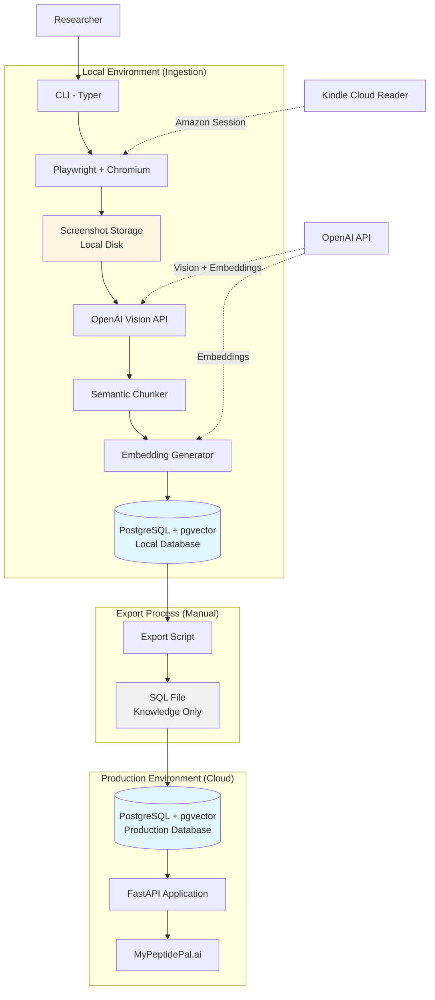
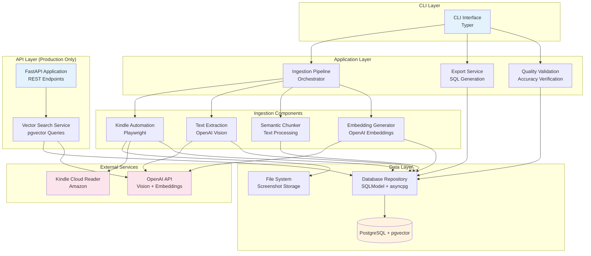
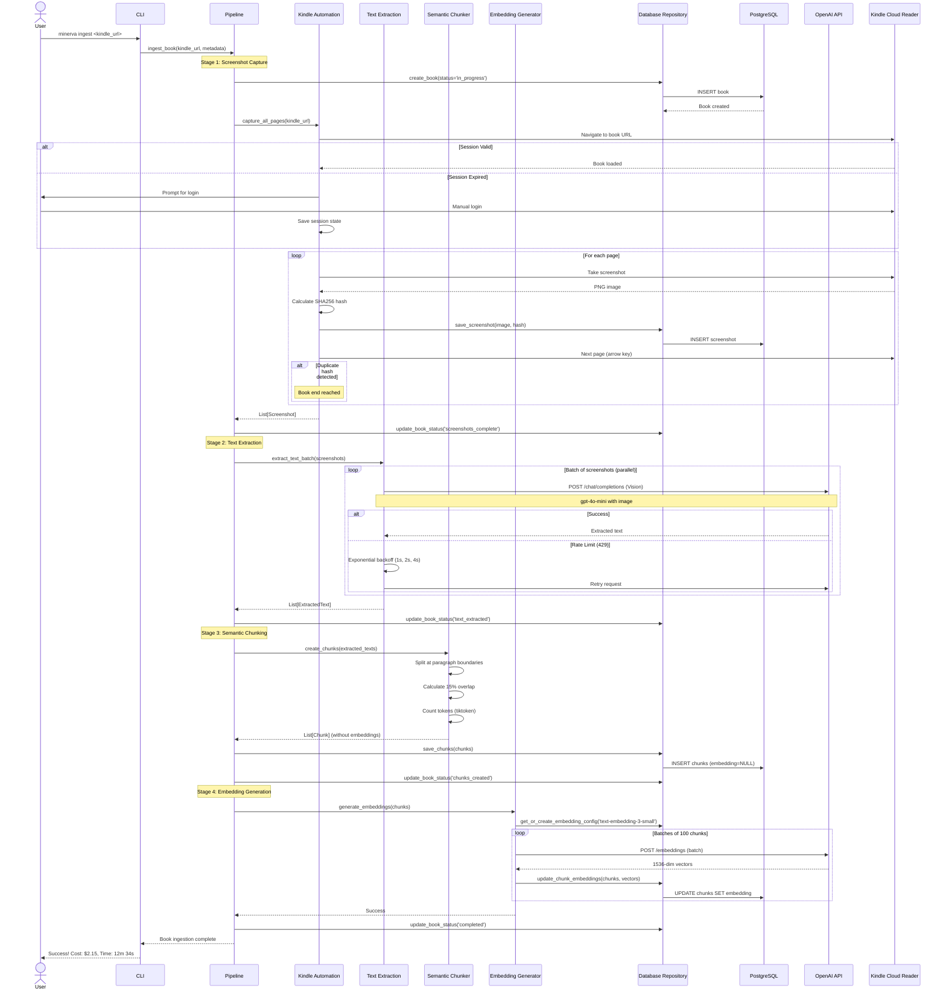
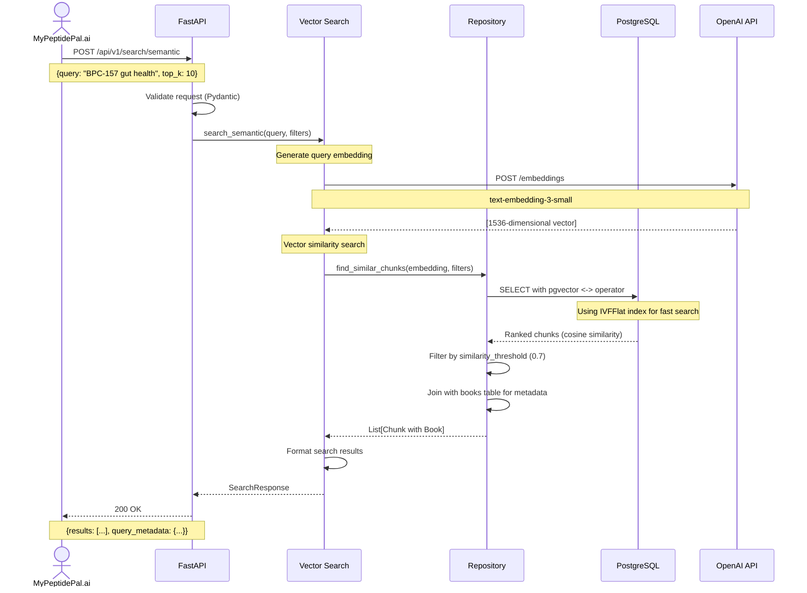
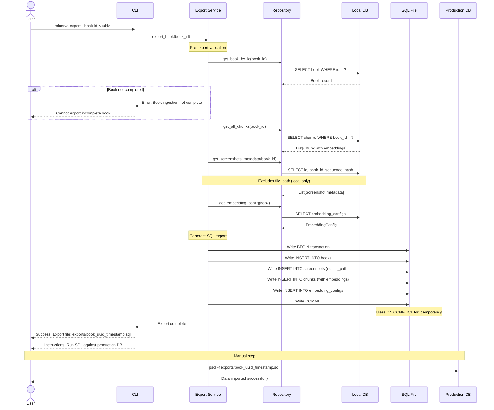

# Minerva Architecture Document

**Project:** Minerva
**Version:** 1.1
**Created:** 2025-10-06
**Status:** Production-Ready

---

## Introduction

This document outlines the overall project architecture for **Minerva**, including backend systems, shared services, and non-UI specific concerns. Its primary goal is to serve as the guiding architectural blueprint for AI-driven development, ensuring consistency and adherence to chosen patterns and technologies.

**Relationship to Frontend Architecture:**
Minerva is a backend-focused system with a CLI interface. There is no web frontend for the MVP. The system operates in two deployment modes: local ingestion (with Playwright + GPT processing) and production API (lightweight query serving).

### Starter Template or Existing Project

**N/A - Greenfield project**

This is a greenfield Python project with no starter template. Given Minerva's unique requirements (Playwright automation, two-environment architecture, screenshot storage, pgvector integration), a custom setup is most appropriate. Standard FastAPI templates would include unnecessary complexity and dependencies.

### Change Log

| Date | Version | Description | Author |
|------|---------|-------------|--------|
| 2025-10-06 | 1.0 | Initial architecture document | Winston (Architect) |
| 2025-10-06 | 1.1 | Added Quality Validation component, Rich library to tech stack, performance expectations clarification, marked Phase 1.5 components | Winston (Architect) |

---

## High Level Architecture

### Technical Summary

Minerva is a **dual-environment Python pipeline system** that automates knowledge extraction from Kindle Cloud Reader books into a PostgreSQL vector database. The local environment handles compute-intensive ingestion (Playwright browser automation → OpenAI GPT-4o-mini Vision extraction → semantic chunking → embedding generation), while the production environment deploys a lightweight FastAPI application serving read-only semantic search queries. This architecture separates credential-sensitive operations from public API access, optimizes costs by running heavy processing locally, and enables manual content review before publication. The system uses SQLModel for unified database/API models, pgvector for efficient similarity search, and async/await patterns throughout for concurrent operations.

### High Level Overview

**Architectural Style:** Modular Monolith with Two-Environment Deployment

**Repository Structure:** Monorepo (single repository, all components together)
- Rationale: Solo developer, tightly coupled components, simplified dependency management

**Service Architecture:**

**Local Environment (Ingestion Machine):**
- Full ingestion pipeline with all dependencies
- Playwright + Chromium for browser automation
- OpenAI Vision API integration for text extraction
- Semantic chunking and embedding generation
- Local PostgreSQL database (configured via DATABASE_URL)
- Screenshot storage on local disk
- CLI interface (Typer) for book management
- Optional local API for testing

**Production Environment (Deployed API):**
- Lightweight FastAPI application (read-only queries)
- Production PostgreSQL database (configured via DATABASE_URL)
- No Playwright, no screenshot storage
- RESTful endpoints only
- Hosted on Railway/Fly.io or similar platform

**Data Flow:**
1. Local: CLI triggers ingestion → Screenshots → GPT extraction → Chunks → Embeddings → Local DB
2. Export: Manual SQL export of knowledge-only data (no screenshots)
3. Production: Import SQL → Query API serves MyPeptidePal.ai

**Key Architectural Decisions:**
1. **Two-environment separation:** Keeps Amazon credentials local, reduces production complexity, enables content review
2. **Manual export workflow:** Maintains control over published content, avoids security risks
3. **Async-first design:** FastAPI + asyncpg for concurrent API handling
4. **Configurable models:** Environment variables for easy A/B testing and cost optimization

**Performance Considerations:**
- **Target:** <15 minutes for 100-page book (NFR2: 2-3s per page is aggressive)
- **MVP Expectation:** 5-7 seconds per page total processing time (screenshot + extraction + chunking + embedding)
- **Optimization Path:** Sequential processing in MVP, parallel screenshot processing can be added post-MVP if needed
- **Rationale:** Prioritizing reliability over speed for MVP; 100 pages at 6s/page = 10 minutes (within target)

### High Level Project Diagram



### Architectural and Design Patterns

- **Repository Pattern:** Abstract database access behind repository interfaces - _Rationale:_ Enables testing with mocks, supports potential database migration, separates business logic from data access

- **Pipeline Pattern:** Ingestion orchestrated as sequential stages with clear handoffs - _Rationale:_ Each stage (capture → extract → chunk → embed) is independently testable and can be optimized separately

- **Async/Await Pattern:** Non-blocking I/O throughout API and database operations - _Rationale:_ Critical for API performance under concurrent load, efficient database connection pooling

- **Strategy Pattern:** Configurable model selection via environment variables - _Rationale:_ Enables cost optimization (gpt-4o-mini vs gpt-5) and quality tuning without code changes

- **Dependency Injection:** FastAPI's built-in DI for database sessions and services - _Rationale:_ Simplifies testing, manages async session lifecycle correctly

- **Command Pattern:** CLI commands as discrete, testable operations - _Rationale:_ Clear separation of user interface from business logic, enables scripting

- **Checkpoint/Resume Pattern:** Track ingestion state for failure recovery - _Rationale:_ Long-running ingestion (15+ minutes) needs resilience to network failures, API rate limits

- **Export/Import Pattern:** Manual knowledge-only migration between environments - _Rationale:_ Security (no credentials/screenshots in production), content review, legal compliance

---

## Tech Stack

This is the **DEFINITIVE technology selection** for the entire project. All development must use these exact versions. This table serves as the single source of truth.

### Cloud Infrastructure

- **Provider:** Hybrid (Local + Cloud Hosting)
- **Local Environment:** macOS (Darwin 25.0.0) for ingestion pipeline
- **Production Hosting:** Railway, Fly.io, or Render (lightweight API deployment)
- **Database Hosting:** Supabase or Neon (PostgreSQL with pgvector support)
- **Deployment Regions:** US-based (single region for MVP)

### Technology Stack Table

| Category | Technology | Version | Purpose | Rationale |
|----------|-----------|---------|---------|-----------|
| **Language** | Python | 3.11+ | Primary development language | Modern async/await support, excellent AI/ML ecosystem, type hints, SQLModel compatibility |
| **Package Manager** | Poetry | 1.7+ | Dependency management | Deterministic builds, lockfile for reproducibility, excellent virtual env management |
| **Backend Framework** | FastAPI | 0.104+ | API framework | Best-in-class async support, automatic OpenAPI docs, Pydantic validation, excellent DX |
| **ORM/Models** | SQLModel | 0.0.14+ | Database models + API schemas | Unified Pydantic/SQLAlchemy models, reduces duplication, type safety |
| **Database** | PostgreSQL | 15+ | Primary data store | ACID compliance, pgvector extension support, excellent Python ecosystem |
| **Vector Extension** | pgvector | 0.5+ | Vector similarity search | Native PostgreSQL integration, ivfflat indexing, cosine similarity operators |
| **Database Driver** | asyncpg | 0.29+ | Async PostgreSQL driver | Fastest Python PostgreSQL driver, native async support, connection pooling |
| **Migrations** | Alembic | 1.13+ | Database schema migrations | Industry standard, SQLAlchemy integration, version control for schemas |
| **Browser Automation** | Playwright | 1.40+ | Kindle page capture | Reliable browser automation, screenshot support, session persistence, active maintenance |
| **AI/ML API** | OpenAI Python SDK | 1.12+ | Vision + embeddings | Official SDK, async support, vision model access, embedding generation |
| **Vision Model** | gpt-4o-mini | latest | Screenshot text extraction | Cost-effective ($0.15/1M tokens), 95%+ accuracy, structure-aware extraction |
| **Embedding Model** | text-embedding-3-small | latest | Vector embeddings (1536 dims) | Cost-effective ($0.02/1M tokens), excellent quality, 1536 dimensions for pgvector |
| **Configuration** | Pydantic Settings | 2.5+ | Environment management | Type-safe config, .env file support, validation, nested settings |
| **Environment Files** | python-dotenv | 1.0+ | .env loading | Simple .env parsing, development convenience |
| **CLI Framework** | Typer | 0.9+ | Command-line interface | Intuitive API, automatic help generation, Pydantic integration, excellent UX |
| **CLI UI** | Rich | 13.7+ | Terminal UI and progress bars | Beautiful progress tracking, formatted tables, colored output for CLI |
| **Logging** | structlog | 24.1+ | Structured logging | JSON logging for production, context binding, excellent async support |
| **Testing Framework** | pytest | 7.4+ | Unit + integration tests | Industry standard, excellent plugin ecosystem, fixture support |
| **Async Testing** | pytest-asyncio | 0.23+ | Async test support | Required for testing FastAPI + asyncpg code |
| **HTTP Client (tests)** | httpx | 0.26+ | API testing client | Async support, drop-in requests replacement, excellent for FastAPI tests |
| **Code Formatting** | black | 24.1+ | Code formatting | Opinionated formatter, eliminates style debates, consistent codebase |
| **Linting** | ruff | 0.1+ | Linting + import sorting | Extremely fast, replaces flake8/isort/pylint, modern Python linter |
| **Type Checking** | mypy | 1.8+ | Static type checking | Catches type errors, enforces type hints, critical for large codebases |
| **Image Processing** | Pillow | 10.1+ | Screenshot handling | Image format conversion, future optimization (compression) |
| **Token Counting** | tiktoken | 0.5+ | Accurate token counting | OpenAI's official tokenizer, accurate cost estimation, chunking optimization |
| **Monitoring (Prod)** | Native platform logging | N/A | Log aggregation | Railway/Fly.io native logging, structlog JSON output |
| **Error Tracking (Prod)** | Sentry | 1.40+ | Error monitoring (optional) | Real-time error tracking, performance monitoring, free tier available |
| **CI/CD** | GitHub Actions | N/A | Automated testing + deployment | Free for public repos, excellent Python support, Railway/Fly.io integration |

---

## Data Models

These are the core data entities that represent Minerva's knowledge base. Models are defined using SQLModel, which provides both database schema (SQLAlchemy) and API validation (Pydantic) in a single definition.

### Book

**Purpose:** Represents a single Kindle book that has been ingested or is in the process of ingestion. Tracks metadata, ingestion status, and relationships to screenshots and chunks.

**Key Attributes:**
- `id`: UUID - Primary key, unique identifier for the book
- `title`: str - Book title (extracted from Kindle or user-provided)
- `author`: str (optional) - Book author
- `kindle_url`: str - Kindle Cloud Reader URL for this book
- `total_screenshots`: int (optional) - Count of captured screenshots
- `capture_date`: datetime - When screenshot capture started
- `ingestion_status`: str - Current state: 'in_progress', 'screenshots_complete', 'text_extracted', 'chunks_created', 'embeddings_generated', 'completed', 'failed'
- `ingestion_error`: str (optional) - Error message if ingestion failed
- `metadata`: dict (JSONB) - Flexible storage for ISBN, publication year, etc.
- `created_at`: datetime - Record creation timestamp
- `updated_at`: datetime - Last update timestamp

**Relationships:**
- One-to-many with Screenshot (book has many screenshots)
- One-to-many with Chunk (book has many chunks)
- One-to-many with IngestionLog (book has many log entries)

### Screenshot

**Purpose:** Represents a single page screenshot captured from Kindle Cloud Reader. Stores file location, sequence order, and hash for deduplication. Screenshots are stored locally only and never exported to production.

**Key Attributes:**
- `id`: UUID - Primary key, unique identifier for the screenshot
- `book_id`: UUID - Foreign key to Book
- `sequence_number`: int - Page order (1, 2, 3...), unique per book
- `file_path`: str - Local filesystem path to PNG file (e.g., `screenshots/{book_id}/page_001.png`)
- `screenshot_hash`: str - SHA256 hash for duplicate detection and book-end verification
- `captured_at`: datetime - Timestamp when screenshot was captured

**Relationships:**
- Many-to-one with Book (screenshot belongs to one book)
- Referenced by Chunk.screenshot_ids array (chunks can span multiple screenshots)

**Constraints:**
- Unique constraint on (book_id, sequence_number) - prevents duplicate page numbers

### EmbeddingConfig

**Purpose:** Tracks which embedding model and version was used to generate embeddings. Enables re-embedding capability and model upgrade tracking. Multiple configs can exist (historical), but only one is active at a time.

**Key Attributes:**
- `id`: UUID - Primary key, unique identifier for the config
- `model_name`: str - OpenAI model name (e.g., 'text-embedding-3-small')
- `model_version`: str (optional) - Model version identifier if available
- `dimensions`: int - Vector dimensions (1536 for text-embedding-3-small)
- `is_active`: bool - True if this is the current embedding model
- `created_at`: datetime - When this config was created

**Relationships:**
- One-to-many with Chunk (config is referenced by many chunks)

### Chunk

**Purpose:** Represents a semantic text chunk extracted from book screenshots. Contains the extracted text, its vector embedding for semantic search, and references to source screenshots. This is the primary searchable entity.

**Key Attributes:**
- `id`: UUID - Primary key, unique identifier for the chunk
- `book_id`: UUID - Foreign key to Book
- `screenshot_ids`: list[UUID] - Array of screenshot IDs this chunk spans (typically 1, sometimes 2 for overlapping chunks)
- `chunk_sequence`: int - Order of chunk within book (1, 2, 3...)
- `chunk_text`: str - Extracted text content (500-800 tokens typically)
- `chunk_token_count`: int - Actual token count using tiktoken
- `embedding_config_id`: UUID - Foreign key to EmbeddingConfig
- `embedding`: Vector(1536) - pgvector type, semantic embedding
- `vision_model`: str - Which GPT model extracted this text (e.g., 'gpt-4o-mini')
- `metadata_model`: str (optional) - Which model extracted metadata (Phase 1.5)
- `extracted_peptides`: list[str] (optional) - Peptide names found (Phase 1.5)
- `extracted_dosages`: list[str] (optional) - Dosages mentioned (Phase 1.5)
- `extracted_studies`: list[str] (optional) - Study references (Phase 1.5)
- `contains_peptide_data`: bool - Flag for filtering (Phase 1.5)
- `extraction_confidence`: dict (JSONB, optional) - Confidence scores (Phase 1.5)
- `created_at`: datetime - Record creation timestamp

**Relationships:**
- Many-to-one with Book (chunk belongs to one book)
- Many-to-one with EmbeddingConfig (chunk uses one embedding config)
- References multiple Screenshot entities via screenshot_ids array

**Indexes:**
- B-tree index on book_id (for filtering searches by book)
- IVFFlat index on embedding (for fast cosine similarity search)

### IngestionLog

**Purpose:** Debugging and audit trail for ingestion pipeline. Tracks key events, errors, and warnings during book processing. Useful for troubleshooting failed ingestions.

**Key Attributes:**
- `id`: UUID - Primary key
- `book_id`: UUID - Foreign key to Book
- `log_level`: str - 'INFO', 'WARNING', 'ERROR'
- `message`: str - Human-readable log message
- `metadata`: dict (JSONB, optional) - Additional structured context
- `created_at`: datetime - Log entry timestamp

**Relationships:**
- Many-to-one with Book (log entry belongs to one book)

---

## Components

Based on the modular monolith architecture, Minerva is organized into logical components with clear responsibilities and interfaces. Each component is a Python module or package within the monorepo.

### CLI Interface

**Responsibility:** User-facing command-line interface for all Minerva operations. Provides commands for ingestion, export, re-embedding, and system management.

**Key Interfaces:**
- `minerva ingest <kindle_url>` - Start book ingestion pipeline
- `minerva export --book-id <uuid>` - Export book to production SQL
- `minerva re-embed --book-id <uuid> [--model <name>]` - Regenerate embeddings
- `minerva list` - List all books and their status
- `minerva status --book-id <uuid>` - Check ingestion progress

**Dependencies:**
- Ingestion Pipeline (orchestrates ingestion workflow)
- Export Service (generates SQL exports)
- Database Repository (queries book status)

**Technology Stack:**
- Typer 0.9+ for CLI framework
- Rich library for progress bars and formatted output
- Pydantic for input validation

**Module Location:** `minerva/cli/app.py`

### Ingestion Pipeline

**Responsibility:** Orchestrates the complete end-to-end book ingestion workflow. Manages state transitions, error handling, and coordinates between sub-components (Kindle Automation → Text Extraction → Chunking → Embedding).

**Key Interfaces:**
- `async def ingest_book(kindle_url: str, metadata: dict) -> Book` - Main entry point
- `async def resume_ingestion(book_id: UUID) -> Book` - Resume failed ingestion
- `async def get_ingestion_status(book_id: UUID) -> IngestionStatus` - Progress tracking

**Dependencies:**
- Kindle Automation (screenshot capture)
- Text Extraction (GPT Vision processing)
- Semantic Chunker (text processing)
- Embedding Generator (vector generation)
- Database Repository (persistence)

**Technology Stack:**
- Python async/await for concurrent operations
- structlog for detailed logging
- Database transactions for state consistency

**Module Location:** `minerva/core/ingestion/pipeline.py`

### Kindle Automation

**Responsibility:** Browser automation for Kindle Cloud Reader. Handles authentication, session persistence, page navigation, and screenshot capture.

**Key Interfaces:**
- `async def authenticate(kindle_url: str) -> BrowserContext` - Handle login, save session
- `async def capture_all_pages(kindle_url: str) -> list[Screenshot]` - Capture full book
- `async def capture_single_page() -> bytes` - Screenshot current page
- `async def detect_book_end() -> bool` - Detect last page

**Dependencies:**
- Screenshot storage (filesystem)
- Database Repository (save screenshot records)

**Technology Stack:**
- Playwright 1.40+ with Chromium
- Session state persistence to `~/.minerva/session_state.json`
- SHA256 hashing for duplicate detection

**Module Location:** `minerva/core/ingestion/kindle_automation.py`

### Text Extraction

**Responsibility:** Extracts structured text from screenshot images using OpenAI Vision API. Preserves document structure (headers, paragraphs, lists) and handles API errors/rate limits.

**Key Interfaces:**
- `async def extract_text(screenshot: Screenshot) -> ExtractedText` - Single screenshot
- `async def extract_text_batch(screenshots: list[Screenshot]) -> list[ExtractedText]` - Batch processing
- `def get_extraction_prompt() -> str` - GPT Vision prompt template

**Dependencies:**
- OpenAI API (Vision models)
- Configuration (model selection, API key)

**Technology Stack:**
- OpenAI Python SDK 1.12+ (async client)
- Configurable vision model (default: gpt-4o-mini)
- Exponential backoff for rate limit handling
- tiktoken for token counting

**Module Location:** `minerva/core/ingestion/text_extraction.py`

### Semantic Chunker

**Responsibility:** Breaks extracted text into semantic chunks with configurable overlap. Ensures chunks are optimally sized for vector search and preserve context across boundaries.

**Key Interfaces:**
- `def create_chunks(extracted_texts: list[ExtractedText]) -> list[Chunk]` - Main chunking
- `def calculate_overlap(chunk1: str, chunk2: str) -> str` - Generate overlap text
- `def count_tokens(text: str) -> int` - Accurate token counting

**Dependencies:**
- tiktoken (OpenAI tokenizer)
- Configuration (chunk size, overlap percentage)

**Technology Stack:**
- tiktoken 0.5+ for accurate token counting
- Regex for paragraph/section boundary detection
- Target chunk size: 500-800 tokens
- Default overlap: 15% (configurable)

**Module Location:** `minerva/core/ingestion/semantic_chunking.py`

### Embedding Generator

**Responsibility:** Generates vector embeddings for text chunks using OpenAI Embeddings API. Supports batch processing, tracks embedding configs, and enables re-embedding.

**Key Interfaces:**
- `async def generate_embeddings(chunks: list[Chunk]) -> None` - Generate and persist
- `async def re_embed_book(book_id: UUID, new_model: str) -> None` - Regenerate embeddings
- `def get_or_create_embedding_config(model_name: str) -> EmbeddingConfig` - Config management

**Dependencies:**
- OpenAI API (Embeddings models)
- Database Repository (persist embeddings)
- Configuration (embedding model selection)

**Technology Stack:**
- OpenAI Python SDK 1.12+ (async embeddings API)
- Default model: text-embedding-3-small (1536 dimensions)
- Batch API support for cost savings (50% cheaper)
- asyncio for concurrent API calls

**Module Location:** `minerva/core/ingestion/embedding_generator.py`

### Database Repository

**Responsibility:** Abstracts all database operations behind a clean interface. Manages async sessions, transactions, and provides CRUD operations for all models.

**Key Interfaces:**
- `async def create_book(data: BookCreate) -> Book` - Create book record
- `async def update_book_status(book_id: UUID, status: str) -> Book` - Update status
- `async def save_screenshots(screenshots: list[Screenshot]) -> None` - Bulk insert
- `async def save_chunks(chunks: list[Chunk]) -> None` - Bulk insert with embeddings
- `async def get_book_by_id(book_id: UUID) -> Book | None` - Retrieve book
- `async def list_books(limit: int, offset: int) -> list[Book]` - Pagination

**Dependencies:**
- SQLModel (ORM)
- asyncpg (database driver)

**Technology Stack:**
- SQLModel 0.0.14+ for models
- asyncpg 0.29+ for async driver
- Alembic 1.13+ for migrations
- Connection pooling (10 max connections)

**Module Location:** `minerva/db/repositories/`

### API Layer (FastAPI)

**Responsibility:** RESTful API serving semantic search and book/chunk retrieval. Provides OpenAPI documentation and handles request validation. **Production deployment only** - lightweight, no ingestion capabilities.

**Key Interfaces:**
- `POST /api/v1/search/semantic` - Vector similarity search
- `GET /api/v1/books` - List books with pagination
- `GET /api/v1/books/{book_id}` - Book details
- `GET /api/v1/chunks/{chunk_id}` - Chunk with context
- `GET /health` - Health check endpoint

**Dependencies:**
- Vector Search Service (semantic search logic)
- Database Repository (data access)

**Technology Stack:**
- FastAPI 0.104+ (async framework)
- Pydantic for request/response validation
- CORS middleware for MyPeptidePal.ai
- structlog for request logging

**Module Location:** `minerva/api/`

**Deployment:** Production only (Railway/Fly.io), excludes Playwright dependencies

### Vector Search Service

**Responsibility:** Executes semantic similarity searches using pgvector. Generates query embeddings, performs vector search with filters, and returns ranked results.

**Key Interfaces:**
- `async def search_semantic(query: str, filters: SearchFilters) -> list[SearchResult]` - Main search
- `async def generate_query_embedding(query: str) -> list[float]` - Embed query
- `async def find_similar_chunks(embedding: list[float], filters: SearchFilters) -> list[Chunk]` - Vector search

**Dependencies:**
- OpenAI API (query embedding)
- Database Repository (vector queries)

**Technology Stack:**
- pgvector cosine similarity operator (`<->`)
- IVFFlat index for performance
- OpenAI text-embedding-3-small for query embeddings
- asyncpg for raw SQL vector queries

**Module Location:** `minerva/core/search/vector_search.py`

### Export Service

**Responsibility:** Generates SQL export files for migrating knowledge from local database to production. Creates knowledge-only exports (no screenshots, no file paths).

**Key Interfaces:**
- `async def export_book(book_id: UUID, output_path: Path) -> ExportReport` - Export single book
- `async def export_all_books(output_dir: Path) -> list[ExportReport]` - Export all completed
- `def validate_export(book_id: UUID) -> ValidationResult` - Pre-export validation

**Dependencies:**
- Database Repository (query data)
- Configuration (export paths)

**Technology Stack:**
- SQLAlchemy for SQL generation
- Jinja2 for SQL templates (optional)
- Transactional SQL with BEGIN/COMMIT wrappers

**Module Location:** `minerva/core/export/export_service.py`

**Export Contents:**
- Book records (excluding local-only fields)
- All chunks with embeddings
- Screenshot metadata (id, sequence, hash only - **no file_path**)
- EmbeddingConfig records
- Uses `INSERT ... ON CONFLICT` for idempotency

### Quality Validation Service

**Responsibility:** Validates text extraction accuracy to ensure 95%+ quality target. Provides spot-checking utilities, quality metrics, and validation reports for ingested books.

**Key Interfaces:**
- `async def spot_check_book(book_id: UUID, sample_size: int = 10) -> ValidationReport` - Random sampling validation
- `async def validate_extraction_accuracy(screenshot_id: UUID, extracted_text: str) -> float` - Single page validation
- `def generate_quality_report(validations: list[ValidationResult]) -> QualityReport` - Aggregate metrics
- `async def interactive_spot_check(book_id: UUID) -> None` - CLI-based manual validation

**Dependencies:**
- Database Repository (retrieve screenshots and chunks)
- Screenshot storage (display images for manual validation)

**Technology Stack:**
- PIL/Pillow for image display in terminal
- Rich for side-by-side text/image display
- Statistics module for accuracy aggregation
- Manual human validation (primary method)

**Module Location:** `minerva/utils/quality_validation.py`

**Validation Process:**
1. Randomly select N screenshots from completed book
2. Display screenshot alongside extracted text
3. Prompt user for accuracy rating (1-10) and error notes
4. Calculate aggregate accuracy percentage
5. Generate quality report with error patterns
6. Flag books below 9.5/10 (95%) threshold for review

**Quality Metrics Tracked:**
- Accuracy score per page (1-10 scale)
- Common error types (tables, formatting, special characters)
- Vision model used (for A/B testing)
- Confidence level based on sample size

### Component Diagram



---

## External APIs

Minerva integrates with external services for AI-powered text extraction and embeddings. These integrations are critical to the system's core functionality.

### OpenAI API

**Purpose:** Provides GPT Vision models for screenshot text extraction and text-embedding models for semantic vector generation.

**Documentation:** https://platform.openai.com/docs/api-reference

**Base URL(s):**
- `https://api.openai.com/v1/chat/completions` (Vision)
- `https://api.openai.com/v1/embeddings` (Embeddings)

**Authentication:** Bearer token (API key)
- Method: `Authorization: Bearer $OPENAI_API_KEY`
- API key stored in environment variable `OPENAI_API_KEY`
- Never logged or exposed in error messages

**Rate Limits:**
- **Tier 1** (default for new accounts):
  - 500 requests per minute (RPM)
  - 200,000 tokens per minute (TPM)
- **Tier 2+** (after $50+ spending):
  - 5,000 RPM, 2,000,000 TPM
- **Batch API:** 50% cost reduction, 24-hour processing window

**Key Endpoints Used:**

**1. Vision API (Text Extraction)**
- `POST /v1/chat/completions`
- Purpose: Extract structured text from screenshot images
- Cost: $0.15 per 1M input tokens + $0.60 per 1M output tokens (gpt-4o-mini)
- Expected tokens per page: ~500-1000 input, ~200-400 output
- Estimated cost per page: ~$0.0001-0.0002

**2. Embeddings API (Vector Generation)**
- `POST /v1/embeddings`
- Purpose: Generate 1536-dimensional vector embeddings for semantic search
- Cost: $0.02 per 1M tokens (standard) or $0.01 per 1M tokens (batch)
- Batch size: Up to 2048 inputs per request
- Expected tokens per chunk: ~500-800
- Estimated cost per 200 chunks: ~$0.01-0.02

**Integration Notes:**

**Error Handling:**
- **429 (Rate Limit):** Exponential backoff starting at 1s, max 3 retries
- **5xx (Server Error):** Retry up to 3 times with 2s delay
- **4xx (Client Error):** Log and fail immediately (no retry)
- Track retry attempts in ingestion logs

**Cost Optimization:**
- Use "low" detail level for Vision API (reduces tokens by ~85%)
- Batch embeddings requests (100 chunks per call)
- Consider Batch API for non-urgent books (50% cost savings)
- Log all token usage for budget tracking

**Timeout Configuration:**
- Vision API: 60s timeout (large images can be slow)
- Embeddings API: 30s timeout (typically fast)
- Connection timeout: 10s

### Kindle Cloud Reader (Amazon)

**Purpose:** Source of book content. Minerva accesses Kindle books through browser automation (Playwright), not a formal API.

**Access Method:** Web scraping via Playwright browser automation

**Base URL(s):** `https://read.amazon.com/`

**Authentication:**
- Method: Manual login via visible browser window (one-time)
- Session persistence: Browser context state saved to `~/.minerva/session_state.json`
- Session duration: Typically 30-90 days before re-authentication required
- Security: Credentials never stored, only session cookies

**Integration Notes:**

**Reliability Concerns:**
- Amazon UI changes can break automation (medium risk)
- Solution: Use robust selectors, test regularly, graceful fallback
- Session expiration: Detect auth failures, prompt for re-login

**Legal & Terms of Service:**
- Minerva respects Amazon's ToS by:
  - Only capturing visual content (no DRM circumvention)
  - Personal use only (not commercial)
  - No redistribution of screenshots
  - Mimicking human reading behavior
- Screenshots stored locally only, never exported to production

**Error Handling:**
- Session expired: Detect, pause, prompt user to re-authenticate
- Network failures: Retry with exponential backoff (3 attempts)
- Page load timeout: 30s timeout, retry on failure
- Duplicate pages: Skip if screenshot hash matches previous

**Security:**
- Session state file permissions: 600 (owner read/write only)
- Location: `~/.minerva/session_state.json` (outside project directory)
- Never committed to git
- Excluded from exports (production never has Amazon credentials)

---

## Core Workflows

These sequence diagrams illustrate critical system workflows, showing how components interact to fulfill key user journeys from the PRD.

### Workflow 1: Book Ingestion (End-to-End)



### Workflow 2: Semantic Search Query (Production API)



### Workflow 3: Export to Production



_(Continued in next message due to length...)_

## REST API Specification

Minerva provides a RESTful API for querying the knowledge base. This API is deployed in production only (lightweight deployment without ingestion capabilities).

See full OpenAPI 3.0 specification in the PRD document at `docs/prd.md` for complete endpoint definitions including:
- POST /api/v1/search/semantic - Vector similarity search
- GET /api/v1/books - List books with pagination
- GET /api/v1/books/{book_id} - Book details
- GET /api/v1/chunks/{chunk_id} - Chunk with context
- GET /health - Health check endpoint

All endpoints return JSON responses with standard error handling and validation via Pydantic.

---

## Database Schema

Minerva uses PostgreSQL 15+ with the pgvector extension for vector similarity search. The schema supports both local ingestion and production query environments.

```sql
-- Enable required extensions
CREATE EXTENSION IF NOT EXISTS "uuid-ossp";
CREATE EXTENSION IF NOT EXISTS "vector";

-- Books table
CREATE TABLE books (
    id UUID PRIMARY KEY DEFAULT uuid_generate_v4(),
    title VARCHAR(500) NOT NULL,
    author VARCHAR(255),
    kindle_url TEXT NOT NULL,
    total_screenshots INTEGER,
    capture_date TIMESTAMP WITH TIME ZONE DEFAULT NOW(),
    ingestion_status VARCHAR(50) NOT NULL DEFAULT 'in_progress',
    ingestion_error TEXT,
    metadata JSONB,
    created_at TIMESTAMP WITH TIME ZONE DEFAULT NOW(),
    updated_at TIMESTAMP WITH TIME ZONE DEFAULT NOW(),
    CONSTRAINT chk_books_ingestion_status CHECK (ingestion_status IN (
        'in_progress', 'screenshots_complete', 'text_extracted',
        'chunks_created', 'embeddings_generated', 'completed', 'failed'
    ))
);

CREATE INDEX idx_books_status ON books(ingestion_status);
CREATE INDEX idx_books_capture_date ON books(capture_date DESC);
CREATE INDEX idx_books_metadata ON books USING GIN(metadata);

-- Screenshots table
CREATE TABLE screenshots (
    id UUID PRIMARY KEY DEFAULT uuid_generate_v4(),
    book_id UUID NOT NULL REFERENCES books(id) ON DELETE CASCADE,
    sequence_number INTEGER NOT NULL,
    file_path TEXT,  -- NULL in production (not exported)
    screenshot_hash VARCHAR(64) NOT NULL,
    captured_at TIMESTAMP WITH TIME ZONE DEFAULT NOW(),
    CONSTRAINT uq_screenshots_book_sequence UNIQUE (book_id, sequence_number)
);

CREATE INDEX idx_screenshots_book_id ON screenshots(book_id);
CREATE INDEX idx_screenshots_hash ON screenshots(screenshot_hash);

-- Embedding configs table
CREATE TABLE embedding_configs (
    id UUID PRIMARY KEY DEFAULT uuid_generate_v4(),
    model_name VARCHAR(100) NOT NULL,
    model_version VARCHAR(50),
    dimensions INTEGER NOT NULL,
    is_active BOOLEAN DEFAULT TRUE,
    created_at TIMESTAMP WITH TIME ZONE DEFAULT NOW()
);

CREATE INDEX idx_embedding_configs_active ON embedding_configs(is_active) 
    WHERE is_active = TRUE;

-- Chunks table with pgvector
CREATE TABLE chunks (
    id UUID PRIMARY KEY DEFAULT uuid_generate_v4(),
    book_id UUID NOT NULL REFERENCES books(id) ON DELETE CASCADE,
    screenshot_ids UUID[] NOT NULL,
    chunk_sequence INTEGER NOT NULL,
    chunk_text TEXT NOT NULL,
    chunk_token_count INTEGER NOT NULL,
    embedding_config_id UUID REFERENCES embedding_configs(id),
    embedding VECTOR(1536),
    vision_model VARCHAR(50) NOT NULL,
    metadata_model VARCHAR(50),
    extracted_peptides TEXT[],
    extracted_dosages TEXT[],
    extracted_studies TEXT[],
    contains_peptide_data BOOLEAN DEFAULT FALSE,
    extraction_confidence JSONB,
    created_at TIMESTAMP WITH TIME ZONE DEFAULT NOW(),
    CONSTRAINT uq_chunks_book_sequence UNIQUE (book_id, chunk_sequence)
);

CREATE INDEX idx_chunks_book_id ON chunks(book_id);
CREATE INDEX idx_chunks_sequence ON chunks(chunk_sequence);
CREATE INDEX idx_chunks_embedding_config ON chunks(embedding_config_id);
CREATE INDEX idx_chunks_peptides ON chunks USING GIN(extracted_peptides);

-- IVFFlat index for vector similarity search (CRITICAL FOR PERFORMANCE)
CREATE INDEX idx_chunks_embedding_ivfflat ON chunks 
    USING ivfflat (embedding vector_cosine_ops)
    WITH (lists = 100);

-- Ingestion logs table
CREATE TABLE ingestion_logs (
    id UUID PRIMARY KEY DEFAULT uuid_generate_v4(),
    book_id UUID NOT NULL REFERENCES books(id) ON DELETE CASCADE,
    log_level VARCHAR(20) NOT NULL,
    message TEXT NOT NULL,
    metadata JSONB,
    created_at TIMESTAMP WITH TIME ZONE DEFAULT NOW(),
    CONSTRAINT chk_ingestion_logs_level CHECK (log_level IN ('INFO', 'WARNING', 'ERROR'))
);

CREATE INDEX idx_ingestion_logs_book_id ON ingestion_logs(book_id);
CREATE INDEX idx_ingestion_logs_level ON ingestion_logs(log_level);
CREATE INDEX idx_ingestion_logs_created_at ON ingestion_logs(created_at DESC);

-- Helper functions
CREATE OR REPLACE FUNCTION cosine_similarity(a VECTOR, b VECTOR)
RETURNS FLOAT AS $$
    SELECT 1 - (a <-> b);
$$ LANGUAGE SQL IMMUTABLE STRICT PARALLEL SAFE;

-- Trigger for updated_at
CREATE OR REPLACE FUNCTION update_updated_at_column()
RETURNS TRIGGER AS $$
BEGIN
    NEW.updated_at = NOW();
    RETURN NEW;
END;
$$ LANGUAGE plpgsql;

CREATE TRIGGER update_books_updated_at 
    BEFORE UPDATE ON books
    FOR EACH ROW
    EXECUTE FUNCTION update_updated_at_column();

-- Initial data
INSERT INTO embedding_configs (model_name, model_version, dimensions, is_active)
VALUES ('text-embedding-3-small', NULL, 1536, TRUE)
ON CONFLICT DO NOTHING;
```

---

## Source Tree

```plaintext
minerva/
├── .github/
│   └── workflows/
│       ├── ci.yml
│       └── deploy-production.yml
├── .minerva/                          # Local runtime (gitignored)
│   └── session_state.json
├── alembic/
│   ├── versions/
│   │   └── 001_initial_schema.py
│   ├── env.py
│   └── script.py.mako
├── docs/
│   ├── prd.md
│   ├── brief.md
│   └── architecture.md                # This document
├── exports/                           # SQL exports (gitignored)
├── screenshots/                       # Local screenshots (gitignored)
│   └── {book_id}/
│       └── page_*.png
├── tests/
│   ├── conftest.py
│   ├── unit/
│   │   ├── test_semantic_chunker.py
│   │   ├── test_embedding_generator.py
│   │   └── test_vector_search.py
│   ├── integration/
│   │   ├── test_ingestion_pipeline.py
│   │   ├── test_database_repository.py
│   │   └── test_api_endpoints.py
│   └── fixtures/
│       ├── sample_screenshot.png
│       └── extracted_text.txt
├── minerva/
│   ├── __init__.py
│   ├── config.py
│   ├── main.py                        # FastAPI app
│   ├── version.py
│   ├── api/
│   │   ├── __init__.py
│   │   ├── dependencies.py
│   │   ├── routes/
│   │   │   ├── health.py
│   │   │   ├── search.py
│   │   │   ├── books.py
│   │   │   └── chunks.py
│   │   └── schemas/
│   │       ├── search.py
│   │       ├── books.py
│   │       └── common.py
│   ├── cli/
│   │   └── app.py
│   ├── core/
│   │   ├── ingestion/
│   │   │   ├── pipeline.py
│   │   │   ├── kindle_automation.py
│   │   │   ├── text_extraction.py
│   │   │   ├── semantic_chunking.py
│   │   │   ├── embedding_generator.py
│   │   │   └── metadata_extractor.py    # Phase 1.5 - Optional metadata enrichment
│   │   ├── search/
│   │   │   └── vector_search.py
│   │   └── export/
│   │       └── export_service.py
│   ├── db/
│   │   ├── session.py
│   │   ├── models/
│   │   │   ├── book.py
│   │   │   ├── screenshot.py
│   │   │   ├── chunk.py
│   │   │   ├── embedding_config.py
│   │   │   └── ingestion_log.py
│   │   └── repositories/
│   │       ├── book_repository.py
│   │       ├── screenshot_repository.py
│   │       ├── chunk_repository.py
│   │       └── base_repository.py
│   └── utils/
│       ├── logging.py
│       ├── exceptions.py
│       ├── openai_client.py
│       ├── token_counter.py
│       ├── retry.py
│       └── quality_validation.py
├── scripts/
│   ├── setup_local_db.sh
│   ├── reset_db.sh
│   └── run_migrations.sh
├── .env.example
├── .env                               # Local config (gitignored)
├── .gitignore
├── .python-version
├── pyproject.toml
├── poetry.lock
├── alembic.ini
├── mypy.ini
├── pytest.ini
├── .ruff.toml
├── Dockerfile
├── docker-compose.yml
├── README.md
└── LICENSE
```

---

## Infrastructure and Deployment

### Deployment Strategy

**Local Environment (Ingestion):**
- Deployment Method: Direct installation on developer machine
- Dependencies: Full stack (Playwright + Chromium, all Python packages)
- Database: Local PostgreSQL 15+ with pgvector
- Access: CLI only (`minerva` command)
- Updates: `git pull && poetry install && alembic upgrade head`

**Production Environment (API):**
- Deployment Method: Containerized deployment (Docker)
- Platform: Railway.app (recommended) or Fly.io
- CI/CD Platform: GitHub Actions
- Deployment Trigger: Push to `main` branch (automatic)
- Database: External managed PostgreSQL (Supabase/Neon)
- Health Checks: `/health` endpoint for platform monitoring

### Environments

| Environment | Purpose | Backend URL | Database |
|-------------|---------|-------------|----------|
| Development | Local dev, ingestion testing | http://localhost:8000 | Local PostgreSQL |
| Production | Live API serving queries | https://minerva-api.railway.app | Supabase/Neon |

### Rollback Strategy

**Primary Method:** Git-based rollback

**Rollback Procedure:**
1. Identify last known good commit
2. Revert to stable version: `git revert <commit-hash>`
3. Push revert: `git push origin main`
4. GitHub Actions automatically deploys previous version
5. Verify health: `curl https://minerva-api.railway.app/health`

**Recovery Time Objective (RTO):** 5 minutes

---

## Error Handling Strategy

### General Approach

**Error Model:** Exception-based with custom exception hierarchy

**Exception Hierarchy:**
- `MinervaError` (base)
  - `IngestionError`
    - `AuthenticationError`
    - `ScreenshotCaptureError`
    - `TextExtractionError`
    - `EmbeddingGenerationError`
  - `ExternalAPIError`
    - `OpenAIRateLimitError`
    - `OpenAIAPIError`
  - `DatabaseError`
    - `RecordNotFoundError`
  - `APIError`
    - `ValidationError`

**Error Propagation:**
- Low-level components raise specific exceptions
- Mid-level components catch, log, and optionally retry or re-raise
- Top-level components (CLI, API) catch, log, and present user-friendly messages
- Never swallow exceptions silently (always log)

### Logging Standards

**Library:** structlog 24.1+

**Format:** JSON for production, pretty-print for development

**Log Levels:**
- DEBUG: Detailed diagnostic info
- INFO: General informational messages
- WARNING: Recoverable issues (rate limits, retries)
- ERROR: Failures requiring attention
- CRITICAL: System failures

**Required Context:**
- Correlation ID: `request_id` for API, `book_id` for ingestion
- Service Context: Component name
- User Context: Not applicable (single user)

### Error Handling Patterns

**External API Errors - Retry with Exponential Backoff:**
- Rate Limits (429): Retry with exponential backoff (1s, 2s, 4s, 8s, 16s)
- Server Errors (5xx): Retry up to 3 times with 2s delay
- Client Errors (4xx): No retry, log and fail immediately
- Timeouts: Retry once, then fail

**Timeout Configuration:**
- OpenAI Vision API: 60s
- OpenAI Embeddings API: 30s
- Database queries: 10s
- Connection timeout: 10s

**Transaction Strategy:**
- Atomic ingestion stages
- Rollback on failure
- Resume capability via book status tracking

---

## Coding Standards

These standards are **MANDATORY** for all AI agents and human developers.

### Core Standards

**Languages & Runtimes:**
- Python 3.11+ (exactly, not 3.12+)
- All code must have type hints (enforced by mypy)
- Use `async/await` for all I/O operations

**Style & Linting:**
- Formatter: black (line length: 88)
- Linter: ruff
- Type Checker: mypy (strict mode)

### Critical Rules

1. **Never Access Environment Variables Directly** - Use `from minerva.config import settings`
2. **All Database Operations Must Use Repository Pattern** - No direct session.execute() in business logic
3. **All I/O Operations Must Be Async** - No requests, psycopg2, or sync file operations
4. **Never Use `print()` for Logging** - Use structlog
5. **All External API Calls Must Have Timeouts** - Prevent hanging operations
6. **UUIDs Must Be Stored as Strings in APIs** - JSON serialization compatibility
7. **All SQLModel Classes Must Inherit from SQLModel** - Single model for DB and API
8. **Never Commit Secrets or API Keys** - Use .env files (gitignored)
9. **All Retry Logic Must Have Max Attempts** - Prevent infinite loops
10. **Database Sessions Must Use Context Managers** - Automatic cleanup
11. **All Error Logs Must Include Context** - book_id, screenshot_id, etc.
12. **OpenAI API Calls Must Track Token Usage** - Budget tracking
13. **File Paths Must Use pathlib.Path** - Cross-platform compatibility
14. **All Public Functions Must Have Type Hints and Docstrings** - Documentation
15. **Screenshot File Paths Must Never Be Exported** - Security and legal compliance

---

## Test Strategy and Standards

### Testing Philosophy

**Approach:** Test-After Development with Strategic TDD

**Coverage Goals:**
- Unit tests: 80%+ coverage for core business logic
- Integration tests: All critical workflows
- E2E tests: Manual validation only (no automated E2E for Kindle)

**Test Pyramid:**
- Unit Tests (70%): Fast, reliable, catch most bugs
- Integration Tests (30%): Component interactions
- Manual E2E: Kindle automation validation

### Test Organization

**Unit Tests:**
- Framework: pytest 7.4+ with pytest-asyncio
- Location: `tests/unit/`
- Mocking: unittest.mock + pytest-mock
- Coverage: 80%+ for `minerva/core/` and `minerva/db/repositories/`

**Integration Tests:**
- Scope: Multi-component with real database, mocked external APIs
- Location: `tests/integration/`
- Infrastructure: PostgreSQL test database (created/destroyed per session)

**API Tests:**
- Framework: pytest with httpx.AsyncClient
- Scope: Full HTTP request/response cycle with test database

**E2E Tests:**
- Framework: Manual validation only
- Scope: Full workflows with real Kindle and OpenAI API
- Environment: Local development

### CI Integration

GitHub Actions on every push:
1. Lint: `ruff check .`
2. Format Check: `black --check .`
3. Type Check: `mypy minerva/`
4. Unit Tests: `pytest tests/unit -v --cov=minerva`
5. Integration Tests: `pytest tests/integration -v`

---

## Security

### Input Validation

**Validation Library:** Pydantic (built into FastAPI and SQLModel)

**Validation Location:** API boundary, CLI input parsing, database models

**Required Rules:**
1. All external inputs MUST be validated
2. Validation at API boundary before processing
3. Whitelist approach preferred over blacklist

**SQL Injection Prevention:**
- All queries use parameterized queries (SQLAlchemy/asyncpg)
- Never construct SQL with string concatenation

### Authentication & Authorization

**Auth Method:** None for MVP (localhost only, single user)

**Future (Phase 2):** API key authentication for production access

### Secrets Management

**Development:** `.env` file (gitignored) + python-dotenv

**Production:** Railway/Fly.io environment variables

**Code Requirements:**
- ❌ NEVER hardcode secrets
- ✅ Access via `settings` only
- ❌ No secrets in logs or error messages

**Secret Rotation:**
- OpenAI API key: Rotate via dashboard, update environment variable
- Database password: Update in platform, update environment variable

### API Security

**Rate Limiting:** Not implemented for MVP

**CORS Policy:** Configured with specific origins (MyPeptidePal.ai)

**Security Headers:**
- X-Content-Type-Options: nosniff
- X-Frame-Options: DENY
- X-XSS-Protection: 1; mode=block
- Strict-Transport-Security: max-age=31536000

**HTTPS Enforcement:**
- Development: HTTP acceptable (localhost)
- Production: HTTPS only (platform provides SSL)

### Data Protection

**Encryption at Rest:**
- Local: Filesystem encryption (macOS FileVault)
- Production: Supabase/Neon automatic encryption (AES-256)

**Encryption in Transit:**
- API Communication: HTTPS (TLS 1.3)
- Database Connection: SSL/TLS required for production
- OpenAI API: HTTPS (SDK enforces)

**PII Handling:**
- No PII collected (single user, no accounts)
- Amazon credentials: Never stored, only session cookies (local only)

**Screenshot Security:**
- Stored locally only (never uploaded to cloud)
- Not included in exports
- File permissions: 644

### Dependency Security

**Scanning Tool:** GitHub Dependabot (automatic)

**Update Policy:**
- Critical vulnerabilities: Update immediately
- High vulnerabilities: Update within 7 days
- Medium/Low: Update during regular maintenance

**Dependency Pinning:** Pin major versions in pyproject.toml, allow minor/patch updates

---

## Next Steps

**This architecture document is now complete and ready for development handoff.**

### For Development Agents

1. Review this complete architecture document
2. Reference the PRD at `docs/prd.md` for detailed requirements
3. Begin implementation starting with Story 1.1 (Project Initialization)
4. Follow coding standards and patterns defined in this document
5. All architectural decisions are FINAL unless explicitly modified

### For Infrastructure/DevOps

1. Set up local PostgreSQL with pgvector extension
2. Configure Railway/Fly.io for production deployment
3. Set up CI/CD pipeline (GitHub Actions)
4. Configure environment variables in production

### For QA/Testing

1. Set up test database environment
2. Create test fixtures based on data models
3. Implement unit tests following test strategy
4. Plan manual E2E validation scenarios

---

**Document Complete - Ready for Implementation**

---

## Appendix: Key Decisions Summary

**Architectural Decisions:**
1. Two-environment deployment (local ingestion + production API)
2. Modular monolith with clear component boundaries
3. Manual export workflow for security and control
4. Async-first design throughout
5. Repository pattern for data access

**Technology Decisions:**
1. Python 3.11+ with FastAPI and SQLModel
2. PostgreSQL 15+ with pgvector for vector search
3. Playwright for browser automation
4. OpenAI gpt-4o-mini for vision, text-embedding-3-small for embeddings
5. Poetry for dependency management

**Security Decisions:**
1. No authentication for MVP (localhost + trusted network)
2. Environment variables for all secrets
3. Screenshots never leave local machine
4. HTTPS enforcement in production
5. CORS restricted to MyPeptidePal.ai

**Testing Decisions:**
1. 80%+ unit test coverage for core logic
2. Integration tests with test database
3. Manual E2E validation (no automated Kindle testing)
4. GitHub Actions CI/CD pipeline

**Deployment Decisions:**
1. Railway/Fly.io for production API hosting
2. Supabase/Neon for managed PostgreSQL
3. Docker for containerized production deployment
4. Git-based rollback strategy

---

_Architecture Document Version 1.1 - Updated 2025-10-06 by Winston (Architect)_
