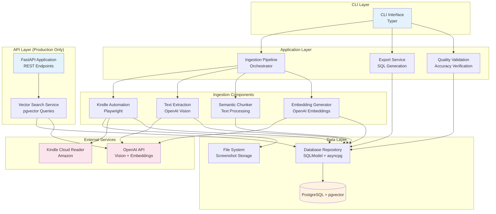

# Components

Based on the modular monolith architecture, Minerva is organized into logical components with clear responsibilities and interfaces. Each component is a Python module or package within the monorepo.

## CLI Interface

**Responsibility:** User-facing command-line interface for all Minerva operations. Provides commands for ingestion, export, re-embedding, and system management.

**Key Interfaces:**
- `minerva ingest <kindle_url>` - Start book ingestion pipeline
- `minerva export --book-id <uuid>` - Export book to production SQL
- `minerva re-embed --book-id <uuid> [--model <name>]` - Regenerate embeddings
- `minerva list` - List all books and their status
- `minerva status --book-id <uuid>` - Check ingestion progress

**Dependencies:**
- Ingestion Pipeline (orchestrates ingestion workflow)
- Export Service (generates SQL exports)
- Database Repository (queries book status)

**Technology Stack:**
- Typer 0.9+ for CLI framework
- Rich library for progress bars and formatted output
- Pydantic for input validation

**Module Location:** `minerva/cli/app.py`

## Ingestion Pipeline

**Responsibility:** Orchestrates the complete end-to-end book ingestion workflow. Manages state transitions, error handling, and coordinates between sub-components (Kindle Automation → Text Extraction → Chunking → Embedding).

**Key Interfaces:**
- `async def ingest_book(kindle_url: str, metadata: dict) -> Book` - Main entry point
- `async def resume_ingestion(book_id: UUID) -> Book` - Resume failed ingestion
- `async def get_ingestion_status(book_id: UUID) -> IngestionStatus` - Progress tracking

**Dependencies:**
- Kindle Automation (screenshot capture)
- Text Extraction (GPT Vision processing)
- Semantic Chunker (text processing)
- Embedding Generator (vector generation)
- Database Repository (persistence)

**Technology Stack:**
- Python async/await for concurrent operations
- structlog for detailed logging
- Database transactions for state consistency

**Module Location:** `minerva/core/ingestion/pipeline.py`

## Kindle Automation

**Responsibility:** Browser automation for Kindle Cloud Reader. Handles authentication, session persistence, page navigation, and screenshot capture.

**Key Interfaces:**
- `async def authenticate(kindle_url: str) -> BrowserContext` - Handle login, save session
- `async def capture_all_pages(kindle_url: str) -> list[Screenshot]` - Capture full book
- `async def capture_single_page() -> bytes` - Screenshot current page
- `async def detect_book_end() -> bool` - Detect last page

**Dependencies:**
- Screenshot storage (filesystem)
- Database Repository (save screenshot records)

**Technology Stack:**
- Playwright 1.40+ with Chromium
- Session state persistence to `~/.minerva/session_state.json`
- SHA256 hashing for duplicate detection

**Module Location:** `minerva/core/ingestion/kindle_automation.py`

## Text Extraction

**Responsibility:** Extracts structured text from screenshot images using OpenAI Vision API. Preserves document structure (headers, paragraphs, lists) and handles API errors/rate limits.

**Key Interfaces:**
- `async def extract_text(screenshot: Screenshot) -> ExtractedText` - Single screenshot
- `async def extract_text_batch(screenshots: list[Screenshot]) -> list[ExtractedText]` - Batch processing
- `def get_extraction_prompt() -> str` - GPT Vision prompt template

**Dependencies:**
- OpenAI API (Vision models)
- Configuration (model selection, API key)

**Technology Stack:**
- OpenAI Python SDK 1.12+ (async client)
- Configurable vision model (default: gpt-4o-mini)
- Exponential backoff for rate limit handling
- tiktoken for token counting

**Module Location:** `minerva/core/ingestion/text_extraction.py`

## Semantic Chunker

**Responsibility:** Breaks extracted text into semantic chunks with configurable overlap. Ensures chunks are optimally sized for vector search and preserve context across boundaries.

**Key Interfaces:**
- `def create_chunks(extracted_texts: list[ExtractedText]) -> list[Chunk]` - Main chunking
- `def calculate_overlap(chunk1: str, chunk2: str) -> str` - Generate overlap text
- `def count_tokens(text: str) -> int` - Accurate token counting

**Dependencies:**
- tiktoken (OpenAI tokenizer)
- Configuration (chunk size, overlap percentage)

**Technology Stack:**
- tiktoken 0.5+ for accurate token counting
- Regex for paragraph/section boundary detection
- Target chunk size: 500-800 tokens
- Default overlap: 15% (configurable)

**Module Location:** `minerva/core/ingestion/semantic_chunking.py`

## Embedding Generator

**Responsibility:** Generates vector embeddings for text chunks using OpenAI Embeddings API. Supports batch processing, tracks embedding configs, and enables re-embedding.

**Key Interfaces:**
- `async def generate_embeddings(chunks: list[Chunk]) -> None` - Generate and persist
- `async def re_embed_book(book_id: UUID, new_model: str) -> None` - Regenerate embeddings
- `def get_or_create_embedding_config(model_name: str) -> EmbeddingConfig` - Config management

**Dependencies:**
- OpenAI API (Embeddings models)
- Database Repository (persist embeddings)
- Configuration (embedding model selection)

**Technology Stack:**
- OpenAI Python SDK 1.12+ (async embeddings API)
- Default model: text-embedding-3-small (1536 dimensions)
- Batch API support for cost savings (50% cheaper)
- asyncio for concurrent API calls

**Module Location:** `minerva/core/ingestion/embedding_generator.py`

## Database Repository

**Responsibility:** Abstracts all database operations behind a clean interface. Manages async sessions, transactions, and provides CRUD operations for all models.

**Key Interfaces:**
- `async def create_book(data: BookCreate) -> Book` - Create book record
- `async def update_book_status(book_id: UUID, status: str) -> Book` - Update status
- `async def save_screenshots(screenshots: list[Screenshot]) -> None` - Bulk insert
- `async def save_chunks(chunks: list[Chunk]) -> None` - Bulk insert with embeddings
- `async def get_book_by_id(book_id: UUID) -> Book | None` - Retrieve book
- `async def list_books(limit: int, offset: int) -> list[Book]` - Pagination

**Dependencies:**
- SQLModel (ORM)
- asyncpg (database driver)

**Technology Stack:**
- SQLModel 0.0.14+ for models
- asyncpg 0.29+ for async driver
- Alembic 1.13+ for migrations
- Connection pooling (10 max connections)

**Module Location:** `minerva/db/repositories/`

## API Layer (FastAPI)

**Responsibility:** RESTful API serving semantic search and book/chunk retrieval. Provides OpenAPI documentation and handles request validation. **Production deployment only** - lightweight, no ingestion capabilities.

**Key Interfaces:**
- `POST /api/v1/search/semantic` - Vector similarity search
- `GET /api/v1/books` - List books with pagination
- `GET /api/v1/books/{book_id}` - Book details
- `GET /api/v1/chunks/{chunk_id}` - Chunk with context
- `GET /health` - Health check endpoint

**Dependencies:**
- Vector Search Service (semantic search logic)
- Database Repository (data access)

**Technology Stack:**
- FastAPI 0.104+ (async framework)
- Pydantic for request/response validation
- CORS middleware for MyPeptidePal.ai
- structlog for request logging

**Module Location:** `minerva/api/`

**Deployment:** Production only (Railway/Fly.io), excludes Playwright dependencies

## Vector Search Service

**Responsibility:** Executes semantic similarity searches using pgvector. Generates query embeddings, performs vector search with filters, and returns ranked results.

**Key Interfaces:**
- `async def search_semantic(query: str, filters: SearchFilters) -> list[SearchResult]` - Main search
- `async def generate_query_embedding(query: str) -> list[float]` - Embed query
- `async def find_similar_chunks(embedding: list[float], filters: SearchFilters) -> list[Chunk]` - Vector search

**Dependencies:**
- OpenAI API (query embedding)
- Database Repository (vector queries)

**Technology Stack:**
- pgvector cosine similarity operator (`<->`)
- IVFFlat index for performance
- OpenAI text-embedding-3-small for query embeddings
- asyncpg for raw SQL vector queries

**Module Location:** `minerva/core/search/vector_search.py`

## Export Service

**Responsibility:** Generates SQL export files for migrating knowledge from local database to production. Creates knowledge-only exports (no screenshots, no file paths).

**Key Interfaces:**
- `async def export_book(book_id: UUID, output_path: Path) -> ExportReport` - Export single book
- `async def export_all_books(output_dir: Path) -> list[ExportReport]` - Export all completed
- `def validate_export(book_id: UUID) -> ValidationResult` - Pre-export validation

**Dependencies:**
- Database Repository (query data)
- Configuration (export paths)

**Technology Stack:**
- SQLAlchemy for SQL generation
- Jinja2 for SQL templates (optional)
- Transactional SQL with BEGIN/COMMIT wrappers

**Module Location:** `minerva/core/export/export_service.py`

**Export Contents:**
- Book records (excluding local-only fields)
- All chunks with embeddings
- Screenshot metadata (id, sequence, hash only - **no file_path**)
- EmbeddingConfig records
- Uses `INSERT ... ON CONFLICT` for idempotency

## Quality Validation Service

**Responsibility:** Validates text extraction accuracy to ensure 95%+ quality target. Provides spot-checking utilities, quality metrics, and validation reports for ingested books.

**Key Interfaces:**
- `async def spot_check_book(book_id: UUID, sample_size: int = 10) -> ValidationReport` - Random sampling validation
- `async def validate_extraction_accuracy(screenshot_id: UUID, extracted_text: str) -> float` - Single page validation
- `def generate_quality_report(validations: list[ValidationResult]) -> QualityReport` - Aggregate metrics
- `async def interactive_spot_check(book_id: UUID) -> None` - CLI-based manual validation

**Dependencies:**
- Database Repository (retrieve screenshots and chunks)
- Screenshot storage (display images for manual validation)

**Technology Stack:**
- PIL/Pillow for image display in terminal
- Rich for side-by-side text/image display
- Statistics module for accuracy aggregation
- Manual human validation (primary method)

**Module Location:** `minerva/utils/quality_validation.py`

**Validation Process:**
1. Randomly select N screenshots from completed book
2. Display screenshot alongside extracted text
3. Prompt user for accuracy rating (1-10) and error notes
4. Calculate aggregate accuracy percentage
5. Generate quality report with error patterns
6. Flag books below 9.5/10 (95%) threshold for review

**Quality Metrics Tracked:**
- Accuracy score per page (1-10 scale)
- Common error types (tables, formatting, special characters)
- Vision model used (for A/B testing)
- Confidence level based on sample size

## Component Diagram

---
