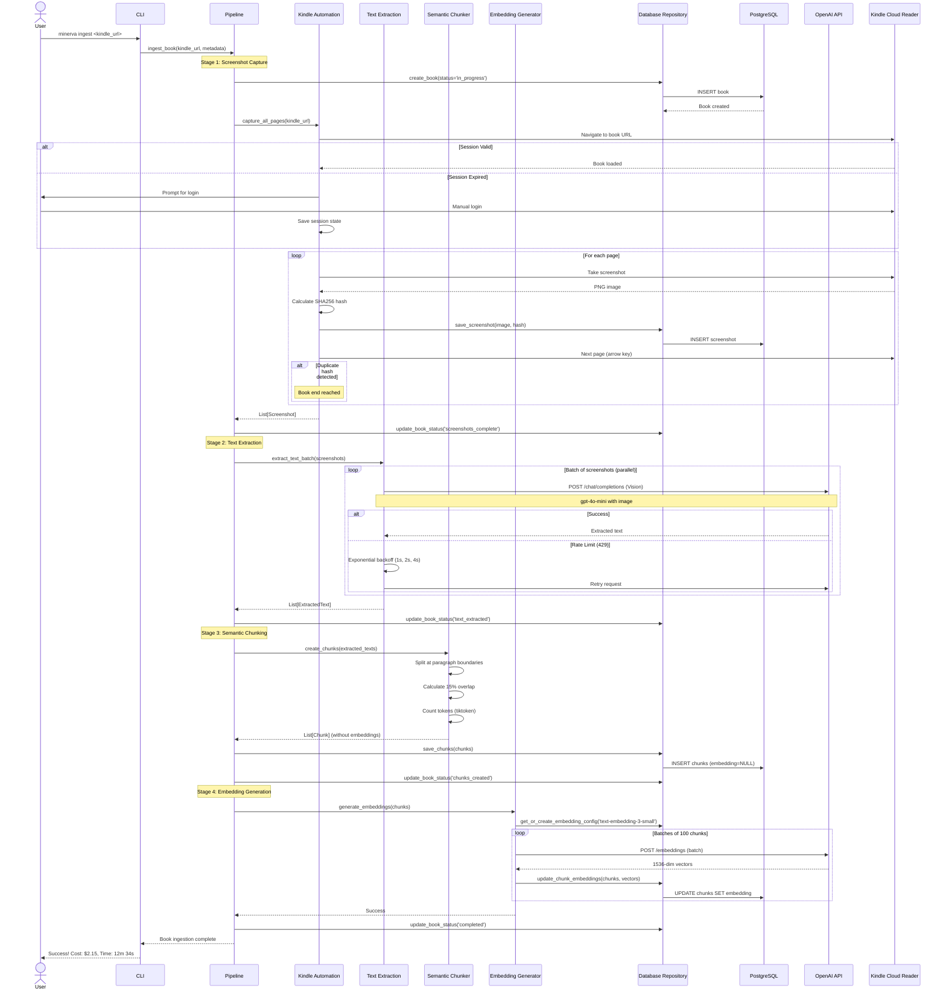
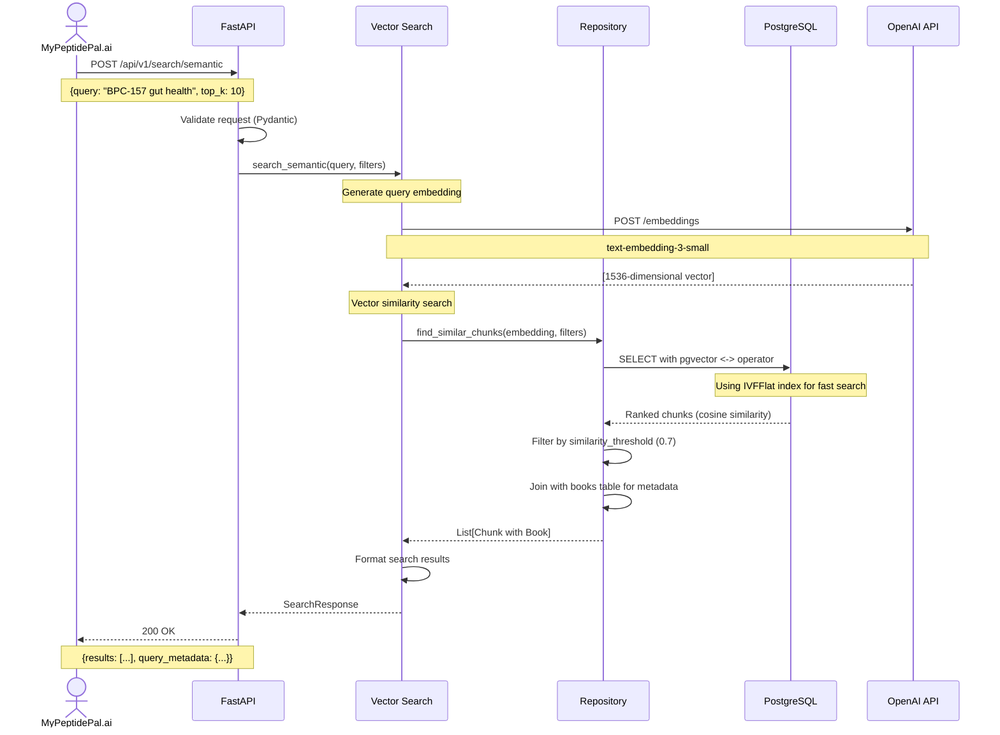
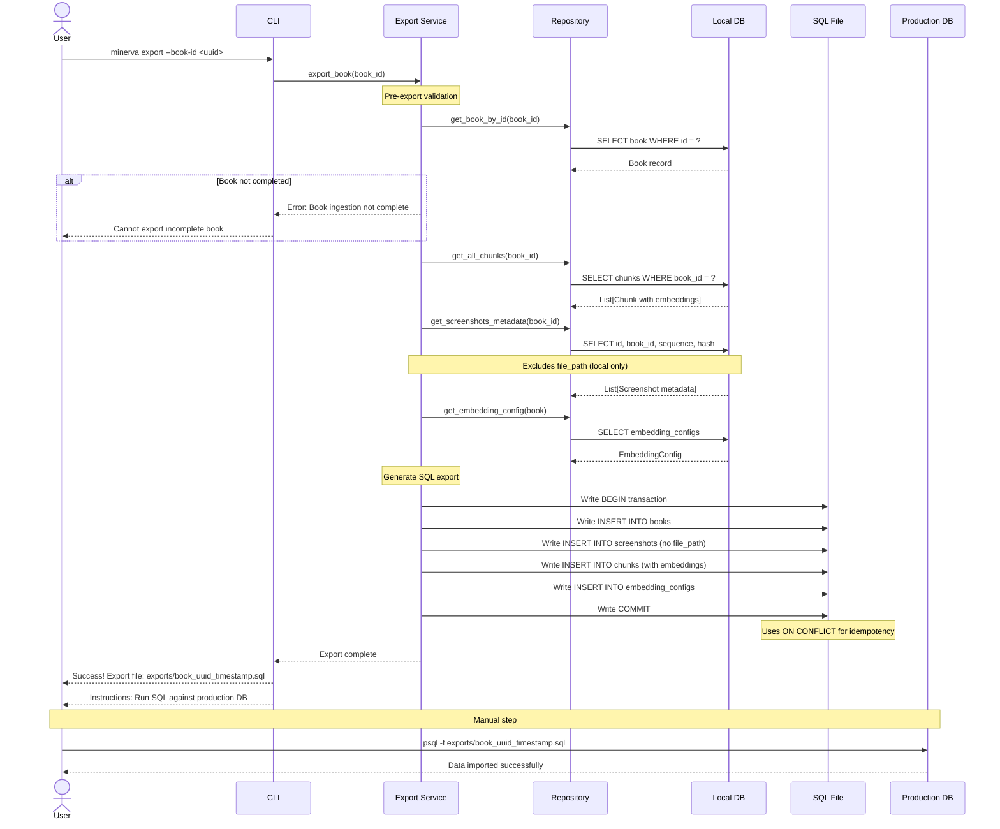

# Core Workflows

These sequence diagrams illustrate critical system workflows, showing how components interact to fulfill key user journeys from the PRD.

## Workflow 1: Book Ingestion (End-to-End)

## Workflow 2: Semantic Search Query (Production API)

## Workflow 3: Export to Production

_(Continued in next message due to length...)_
