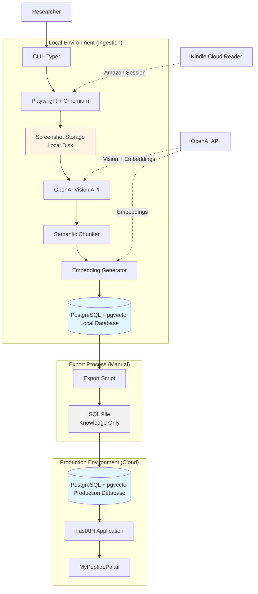

# High Level Architecture

## Technical Summary

Minerva is a **dual-environment Python pipeline system** that automates knowledge extraction from Kindle Cloud Reader books into a PostgreSQL vector database. The local environment handles compute-intensive ingestion (Playwright browser automation → OpenAI GPT-4o-mini Vision extraction → semantic chunking → embedding generation), while the production environment deploys a lightweight FastAPI application serving read-only semantic search queries. This architecture separates credential-sensitive operations from public API access, optimizes costs by running heavy processing locally, and enables manual content review before publication. The system uses SQLModel for unified database/API models, pgvector for efficient similarity search, and async/await patterns throughout for concurrent operations.

## High Level Overview

**Architectural Style:** Modular Monolith with Two-Environment Deployment

**Repository Structure:** Monorepo (single repository, all components together)
- Rationale: Solo developer, tightly coupled components, simplified dependency management

**Service Architecture:**

**Local Environment (Ingestion Machine):**
- Full ingestion pipeline with all dependencies
- Playwright + Chromium for browser automation
- OpenAI Vision API integration for text extraction
- Semantic chunking and embedding generation
- Local PostgreSQL database (configured via DATABASE_URL)
- Screenshot storage on local disk
- CLI interface (Typer) for book management
- Optional local API for testing

**Production Environment (Deployed API):**
- Lightweight FastAPI application (read-only queries)
- Production PostgreSQL database (configured via DATABASE_URL)
- No Playwright, no screenshot storage
- RESTful endpoints only
- Hosted on Railway/Fly.io or similar platform

**Data Flow:**
1. Local: CLI triggers ingestion → Screenshots → GPT extraction → Chunks → Embeddings → Local DB
2. Export: Manual SQL export of knowledge-only data (no screenshots)
3. Production: Import SQL → Query API serves MyPeptidePal.ai

**Key Architectural Decisions:**
1. **Two-environment separation:** Keeps Amazon credentials local, reduces production complexity, enables content review
2. **Manual export workflow:** Maintains control over published content, avoids security risks
3. **Async-first design:** FastAPI + asyncpg for concurrent API handling
4. **Configurable models:** Environment variables for easy A/B testing and cost optimization

**Performance Considerations:**
- **Target:** <15 minutes for 100-page book (NFR2: 2-3s per page is aggressive)
- **MVP Expectation:** 5-7 seconds per page total processing time (screenshot + extraction + chunking + embedding)
- **Optimization Path:** Sequential processing in MVP, parallel screenshot processing can be added post-MVP if needed
- **Rationale:** Prioritizing reliability over speed for MVP; 100 pages at 6s/page = 10 minutes (within target)

## High Level Project Diagram

## Architectural and Design Patterns

- **Repository Pattern:** Abstract database access behind repository interfaces - _Rationale:_ Enables testing with mocks, supports potential database migration, separates business logic from data access

- **Pipeline Pattern:** Ingestion orchestrated as sequential stages with clear handoffs - _Rationale:_ Each stage (capture → extract → chunk → embed) is independently testable and can be optimized separately

- **Async/Await Pattern:** Non-blocking I/O throughout API and database operations - _Rationale:_ Critical for API performance under concurrent load, efficient database connection pooling

- **Strategy Pattern:** Configurable model selection via environment variables - _Rationale:_ Enables cost optimization (gpt-4o-mini vs gpt-5) and quality tuning without code changes

- **Dependency Injection:** FastAPI's built-in DI for database sessions and services - _Rationale:_ Simplifies testing, manages async session lifecycle correctly

- **Command Pattern:** CLI commands as discrete, testable operations - _Rationale:_ Clear separation of user interface from business logic, enables scripting

- **Checkpoint/Resume Pattern:** Track ingestion state for failure recovery - _Rationale:_ Long-running ingestion (15+ minutes) needs resilience to network failures, API rate limits

- **Export/Import Pattern:** Manual knowledge-only migration between environments - _Rationale:_ Security (no credentials/screenshots in production), content review, legal compliance

---
